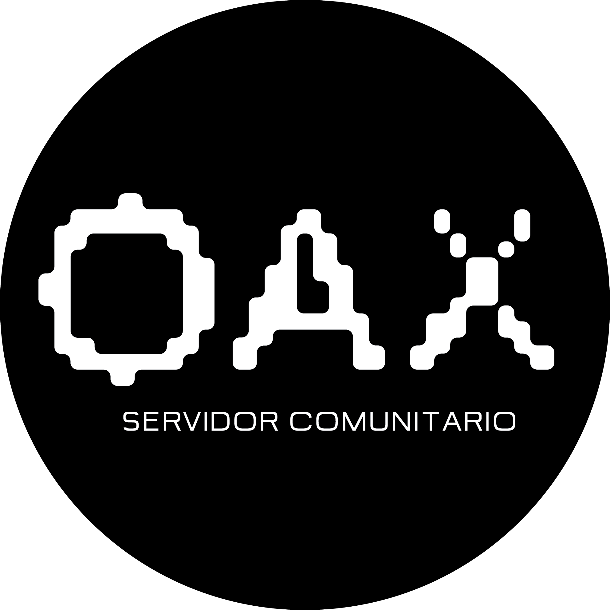

# ¿Qué es OAX?

## Para todOs, todAs y todXs

Se forma como un proyecto conjunto y horizontal que promueve la colectivización de la información. Mucha de esta información
fue generada durante la toma de instalaciones de la ENES Unidad Morelia, esta toma y el paro de actividades se derivó de una 
lucha por la dignificación docente por parte de la Asamblea General de Docentes de Asignatura (AGDA) de la ENES Unidad Morelia 
que fue apoyada por la Asamblea Estudiantil (AsEEM). Ante esta problemática, surgió la necesidad de contar con un espacio 
de acceso remoto para comunicar la información que surgía dentro de las instalaciones y que todos, todas y todxs 
puedan acceder de manera efectiva. De ahí nace el proyecto que estás viendo en estos momentos.

**OAX** funciona como un servidor comunitario que almacenará y distribuirá la información que la comunidad de la ENES Morelia proporcione.
Un servidor, de manera muy básica, es una computadora que está prendida 24/7/365 y que se accesa de manera remota, en este espacio
alojamos la página web de **OAX**. Obviamente, **OAX** no se encuentra en Alaska.
Trabajamos únicamente con programas de código abierto gratuitos, así que este proyecto solamente permitirá contenidos bajo
licencia de [*Creative Commons*](https://creativecommons.org/), pues abogamos por que la información se mantega libre, sin intermediarios y 
evitando medidas que reduzcan, limiten o restrinjan los procesos de creación de cualquier tipo. Si te interesa subir tus proyectos, 
creaciones, etc. te invitamos a compartirlos y colectivizarlos.

¡Por un mundo libre, un internet libre!

Seguimos construyendo una mejor plataforma que pueda ser host de:
- Proyectos
- Investigaciones 
- Radio
- Broadcasting
- Blockchain para votaciones
- y mucho más...

Este es un proyecto en crecimiento y contrucción constante, así que si tienes sugerencias ¡quien propone, se pone!
Trabajemos juntos, juntas y juntxs para generar una plataforma colaborativa.

Att. Doppel, Ambys y Gneiss
